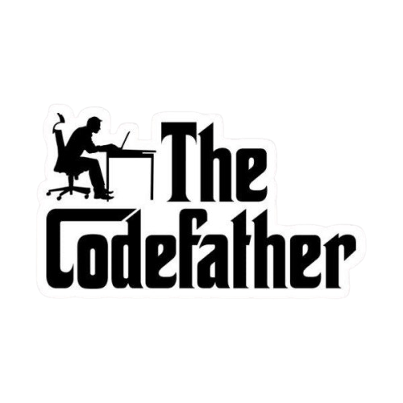

<!--
    Dear user using my README as a base
    to create your own, I’m happy to authorize its use 
    and I’m glad you liked it! I just kindly ask for one thing:

    Please, leave a star on my README it would truly make my day :)
    GitHub: https://github.com/islam890
-->

<!-- Banner -->

<!-- My full name and where I'm from -->

 
   

<!-- Views / Stars / Followers -->
 

  

  

  

 

<!-- Sticker -->

<!-- About Me -->

**Who Am I?**

I am a university student at `University Constantine 2`, specializing in `Software Engineering`.  
My interest in technology began during high school, where I first explored programming through small projects and problem-solving challenges.  
This curiosity quickly grew into a passion for building things that merge creativity with functionality.  

Along the way, I developed skills in **Web Development**, starting with the basics of HTML, CSS, and JavaScript, and later expanding into modern frameworks like `React`.  
I also explored the world of `Backend development` with PHP, Python, SQL, XAMPP, and other programming languages, which gave me a solid foundation to work across the full stack.  

Currently, my main focus is on `Front-End Development`, where I find the perfect balance between logic, design, and user experience.  
At the same time, I’m nurturing a growing interest in `Mobile Applications` and `Artificial Intelligence`, aiming to expand my horizons in these fields.  

Beyond coding, I enjoy sports and design, both of which constantly inspire me to stay disciplined, creative, and motivated.  

 

<!-- Gif -->

<!-- A Little More About Me -->
<h3 align="center">A Little More About Me</h3>

⬛ I like surrounding myself with people who inspire me and push me to improve.  
⬜ At the moment, I’m building projects using React.  
⬛ I’m always open to support anyone curious about Front-End development.  
⬜ I enjoy working on big projects that challenge my problem-solving skills.  
⬛ Passionate about minimalism and simple design.  

🎯 **Professional Objectives**  
- 💼 Build a career as a **Freelancer**  
- 🚀 Establish and grow a **Startup**  
- 🌍 Contribute to a **leading tech company**  
- 📚 Share knowledge with underserved communities  

 

<!-- Contact -->

  <h2>Connect Me</h2>
  
    
    
     
    
  

 

<!-- GitHub Status -->
<h2 align="center">GitHub Status</h2>
 

  

    
  

 

<!-- Languages & Tools -->
<h2 align="center">Languages & Tools I Have Placed My Hands On</h2>

   
   
   
   

 

<!-- Footer -->

  

